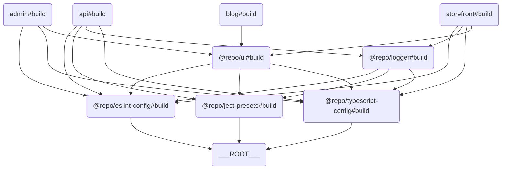

# Build graph

Here is a simple build graph using Mermaid:

```bash
pnpm turbo run build --graph=graph.mermaid
```


```mermaid
graph TD
 QHZT("@repo/eslint-config#build") --> ETTT("___ROOT___")
 JEGP("@repo/jest-presets#build") --> ETTT("___ROOT___")
 EMLE("@repo/logger#build") --> QHZT("@repo/eslint-config#build")
 EMLE("@repo/logger#build") --> JEGP("@repo/jest-presets#build")
 EMLE("@repo/logger#build") --> LRHC("@repo/typescript-config#build")
 LRHC("@repo/typescript-config#build") --> ETTT("___ROOT___")
 GLAO("@repo/ui#build") --> QHZT("@repo/eslint-config#build")
 GLAO("@repo/ui#build") --> JEGP("@repo/jest-presets#build")
 GLAO("@repo/ui#build") --> LRHC("@repo/typescript-config#build")
 VELR("admin#build") --> QHZT("@repo/eslint-config#build")
 VELR("admin#build") --> LRHC("@repo/typescript-config#build")
 VELR("admin#build") --> GLAO("@repo/ui#build")
 TXWC("api#build") --> QHZT("@repo/eslint-config#build")
 TXWC("api#build") --> JEGP("@repo/jest-presets#build")
 TXWC("api#build") --> EMLE("@repo/logger#build")
 TXWC("api#build") --> LRHC("@repo/typescript-config#build")
 WCIN("blog#build") --> GLAO("@repo/ui#build")
 TPBW("storefront#build") --> QHZT("@repo/eslint-config#build")
 TPBW("storefront#build") --> EMLE("@repo/logger#build")
 TPBW("storefront#build") --> LRHC("@repo/typescript-config#build")
 TPBW("storefront#build") --> GLAO("@repo/ui#build")
```
